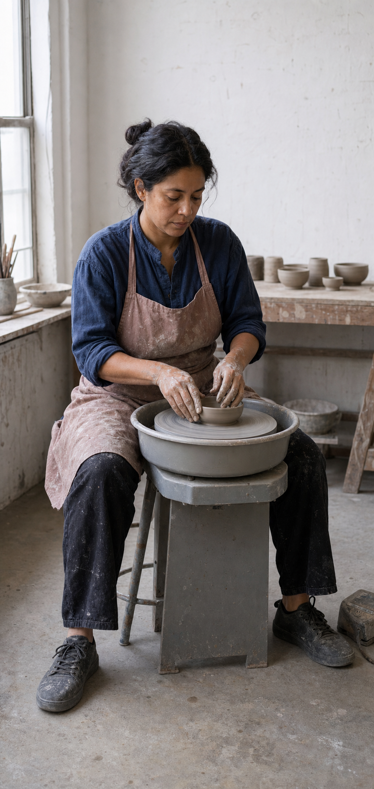
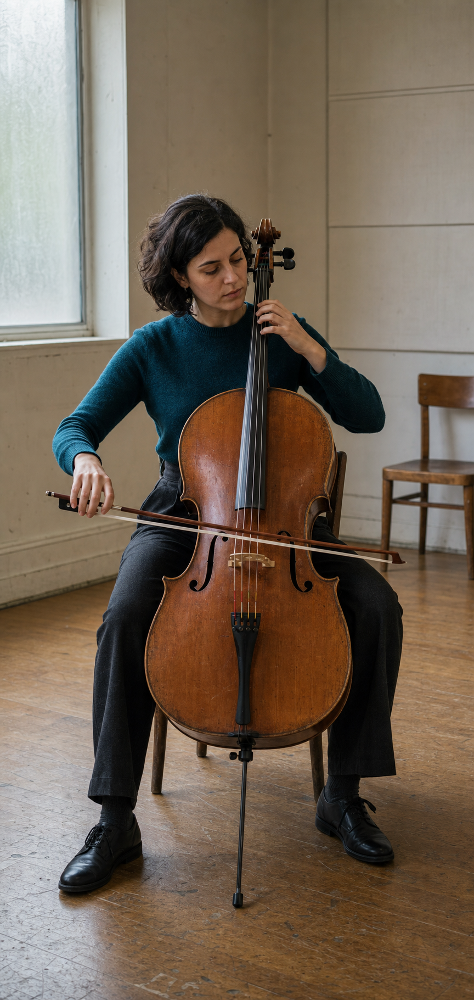
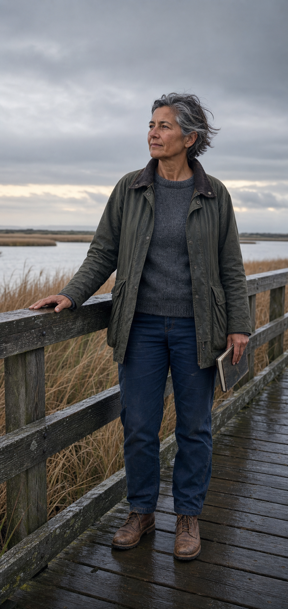
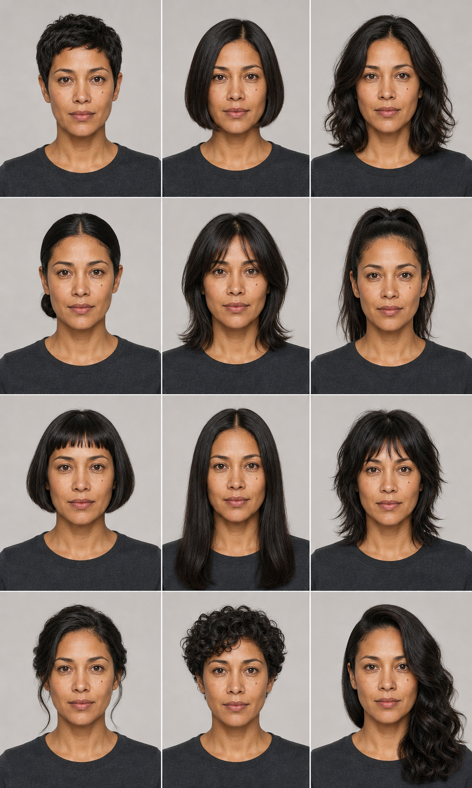

# Visual Director Skill

[中文](#中文) · [English](#english) · [Gallery](gallery/README.md) · [Installation / 安装](docs/installation.md)

Visual Director 是一个可移植的 Codex 视觉生产 Skill。它把模糊的图片需求整理为可验证的 Visual Brief，选择经过验收的第一方模板，编译精确 Prompt，并通过文件检查、视觉复核和批准门禁保护正式资产。

Visual Director is a portable visual-production skill for Codex. It turns an ambiguous image request into a testable Visual Brief, selects a reviewed first-party template, compiles a precise prompt, and protects formal assets with file checks, visual review, and approval gates.

`v0.10.0` · `MIT` · `12 reviewed workflows` · `12 approved gallery assets` · `no paid API required`

## Gallery

| Character Design Sheet / 角色设定表 | Realistic Photography / 真实人物摄影 |
|---|---|
|  |  |
| [Prompt + review / Prompt 与复核](gallery/prompts/character-design-sheet-mara-venn.md) | [Prompt + review / Prompt 与复核](gallery/prompts/realistic-photography-mara-venn.md) |

| Realistic Fashion Lookbook / 写实时装 Lookbook | Product Commerce Visual / 商品商业视觉 |
|---|---|
|  |  |
| [Prompt + review / Prompt 与复核](gallery/prompts/realistic-fashion-lookbook-noa-reyes.md) | [Prompt + review / Prompt 与复核](gallery/prompts/product-commerce-visual-aurora-mini.md) |

| Exploded Product Diagram / 产品分解结构图 |
|---|
|  |
| [Prompt + review / Prompt 与复核](gallery/prompts/exploded-product-diagram-orbital-frame-one.md) |

| Quiet Editorial Portrait / 静谧编辑人像 |
|---|
|  |
| [Prompt + review / Prompt 与复核](gallery/prompts/quiet-editorial-portrait-mira-kang.md) |

| Realistic Motion Editorial / 写实动态编辑摄影 |
|---|
|  |
| [Prompt + review / Prompt 与复核](gallery/prompts/realistic-motion-editorial-leo-navarro.md) |

| Documentary Craft Portrait / 写实手作纪实人像 |
|---|
|  |
| [Prompt + review / Prompt 与复核](gallery/prompts/documentary-craft-portrait-anika-rowan.md) |

| Documentary Music Rehearsal / 写实音乐排练纪实人像 |
|---|
|  |
| [Prompt + review / Prompt 与复核](gallery/prompts/documentary-music-rehearsal-elise-moreau.md) |

| Mature Documentary Portrait / 成熟年龄纪实人像 |
|---|
|  |
| [Prompt + review / Prompt 与复核](gallery/prompts/mature-documentary-portrait-nora-vale.md) |

| Realistic Hairstyle Variation Board / 写实发型变化咨询板 |
|---|
|  |
| [Prompt + review / Prompt 与复核](gallery/prompts/realistic-hairstyle-variation-board-maris-vale.md) |

| Concept Poster Visual Plate / 概念海报视觉底板 |
|---|
|  |
| [Prompt + review / Prompt 与复核](gallery/prompts/concept-poster-visual-plate-solstice-void.md) |

## 中文

### 它解决什么问题

- 把“做一张好看的图”转换为包含目标、尺寸、文案、构图、材质、参考图角色和验收标准的结构化 Brief。
- Prompt 由明确约束编译而成，不依赖堆叠空泛的质量词。
- 只从本项目已经优化、实测并批准公开的模板与案例中选材。
- 图片生成与 Prompt 编译分离；校验、选择、编译、dry-run 和 QC 不调用付费 API。
- 候选图必须依次通过文件、内容、视觉和批准门禁，才可写入正式资产目录。
- 支持“生成透明素材 + 确定性排版”的精确画布路线，适合需要准确尺寸和可读文字的 Hero、广告与产品卡片。

### 核心工作流

```text
Visual Brief
    ↓
Template + Reviewed Example Selection
    ↓
Compiled Prompt
    ↓
Built-in Image Generation or External Handoff
    ↓
File QC → Visual Review → Approval → Formal Asset
```

当前公开版只声明已经实际验收的十二个方向：

1. `character-design-sheet`：人物身份、服装、左右细节和多视图一致性。
2. `realistic-photography`：原创角色的真实摄影转化、自然皮肤、手部和环境可信度。
3. `realistic-fashion-lookbook`：同一成年人物的跨格身份一致性、完整全身和多套写实穿搭。
4. `exploded-product-diagram`：产品内部结构、层级、装配逻辑、材质和分解视图可读性。
5. `quiet-editorial-portrait`：成年主体、端庄穿搭、自然坐姿、柔侧光、留白和非性感化室内编辑人像。
6. `realistic-motion-editorial`：成年全身动态、可信重心、完整肢体、朴素无品牌服装和自然室外摄影。
7. `documentary-craft-portrait`：成年人手作过程、双手与对象接触、材质真实感和自然工作室环境。
8. `documentary-music-rehearsal`：人物与复杂乐器的真实交互、乐器结构、完整人体和自然排练环境。
9. `mature-documentary-portrait`：成熟年龄自然特征、完整站姿、可信手部接触、实用户外服装和非宣传式环境纪实。
10. `realistic-hairstyle-variation-board`：同一成年身份在十二个统一影棚格中的稳定性，以及发型作为唯一变化变量的可控对比。
11. `concept-poster-visual-plate`：单一视觉锚点、材质与配色层级、无文字安全区，以及后续确定性海报排版。
12. `product-commerce-visual`：产品几何、材质、文案空间、语义标注和精确画布合成。

其他视觉类型可以使用通用 Brief、Prompt 编译和 QC 能力，但在新增效果图、最终 Prompt 与测试通过前，不会被标为“已验收模板”。

### 快速开始

要求：Python 3.11+、[`uv`](https://docs.astral.sh/uv/)、Codex CLI。

```bash
git clone https://github.com/WaterTian/visual-director-skill.git
cd visual-director-skill
uv run python -m unittest discover -s tests -v
codex
```

从仓库目录启动 Codex 后，`.agents/skills/visual-director/` 会作为仓库级 Skill 被发现。可以直接说：

> 使用 $visual-director，把这个图片需求整理成 Visual Brief 和生产级 Prompt；不要使用付费 API，生成前先列出硬约束和验收项。

Codex 官方说明确认，仓库级 Skill 可以放在 `.agents/skills`；需要跨项目分发时可打包为 Plugin。参见 [OpenAI Build skills](https://developers.openai.com/codex/skills) 和 [OpenAI Plugins](https://developers.openai.com/codex/plugins)。

### 安装为本地 Plugin

```bash
uv run python scripts/build-plugin-package.py
codex plugin marketplace add .
codex plugin add visual-director@visual-director
codex plugin list
```

安装后新开一个 Codex 任务再使用。完整的安装、升级、卸载和隔离验证步骤见 [安装指南](docs/installation.md)。

### 最小可运行命令

```bash
# 校验 Brief
uv run python scripts/validate-brief.py tests/fixtures/hero-brief.json

# 选择模板与最多 3 个已验收案例
uv run python scripts/select-template.py tests/fixtures/hero-brief.json --top 3
uv run python scripts/select-cases.py tests/fixtures/hero-brief.json --top 3

# 编译 provider-neutral Prompt
uv run python scripts/compile-prompt.py tests/fixtures/hero-brief.json

# 对候选图片运行文件 QC
uv run python scripts/inspect-asset.py \
  tests/fixtures/hero-brief.json path/to/candidate.png \
  --output work/qc-report.json

# 构建可安装 Plugin
uv run python scripts/build-plugin-package.py
```

项目还提供授权受控的生成 handoff、透明素材请求、精确画布合成、人工视觉复核写回和正式资产 promotion。入口与产物说明见 [工作流指南](docs/workflow.md)。

### 公开内容规则

- 公开仓库只收录本项目已经改写、优化、生成、复核并批准的内容。
- Gallery 图片必须有最终 Prompt、尺寸、SHA-256、输入角色和审核状态。
- 研究资料、未通过候选、缓存、密钥、个人绝对路径和付费 API 配置不得进入公开发行版。
- 作者信息只保留在许可证和包清单等必要元数据中，不在每篇文档重复显示。
- `data/templates.json` 与 `data/cases.json` 是当前第一方公开目录；没有通过 Gallery 与测试的方向不会加入已验收清单。

### 文档

- [安装与验证](docs/installation.md)
- [架构与数据流](docs/architecture.md)
- [生产工作流与质量门禁](docs/workflow.md)
- [路线图](docs/roadmap.md)
- [效果图、Prompt 与逐图复核](gallery/README.md)

### 目录

```text
visual-director-skill/
├── .agents/skills/visual-director/  # Codex Skill
├── config/                          # 示例与 provider 能力契约
├── data/                            # 第一方模板、案例与构图预设
├── docs/                            # 中英文公开文档
├── gallery/                         # 已批准效果图、Prompt 与 manifest
├── packages/visual-director/        # Plugin manifest 源文件
├── schemas/                         # 稳定数据契约
├── scripts/                         # 命令入口
├── src/visual_director/             # 核心实现
└── tests/                           # 可观察行为与发布边界测试
```

## English

### What it solves

- Converts a loose request into a Visual Brief covering intent, dimensions, copy, composition, materials, reference roles, and acceptance criteria.
- Compiles prompts from explicit constraints instead of stacking generic quality adjectives.
- Selects only templates and examples that this project has refined, generated, reviewed, and approved.
- Keeps prompt compilation separate from image generation; validation, selection, compilation, dry-runs, and QC do not call a paid API.
- Requires file, content, visual, and approval gates before a candidate can become a formal asset.
- Supports an exact-canvas route that combines a generated transparent material with deterministic layout and typography.

### Reviewed scope

The public catalog currently claims twelve reviewed workflows:

1. `character-design-sheet`: identity, wardrobe, left-right details, anatomy, and multi-view consistency.
2. `realistic-photography`: believable photographic translation of an original character, including skin, hands, wardrobe, and environment.
3. `realistic-fashion-lookbook`: one adult identity preserved across complete full-body cells and multiple realistic wardrobe capsules.
4. `exploded-product-diagram`: internal product structure, part hierarchy, assembly plausibility, material response, and exploded-view readability.
5. `quiet-editorial-portrait`: adult subject boundary, modest styling, natural seated body language, soft side light, negative space, and non-sexualized indoor editorial photography.
6. `realistic-motion-editorial`: an adult full-body action, credible balance, complete limbs, modest unbranded wardrobe, and natural exterior photography.
7. `documentary-craft-portrait`: an adult hands-on craft process, hand-to-object contact, material truth, and a natural workshop environment.
8. `documentary-music-rehearsal`: realistic person-to-complex-instrument interaction, instrument structure, complete anatomy, and a natural rehearsal context.
9. `mature-documentary-portrait`: natural mature age detail, complete standing anatomy, credible hand contact, practical outdoor workwear, and non-promotional environmental documentation.
10. `realistic-hairstyle-variation-board`: one adult identity kept stable across twelve uniform studio cells, with hairstyle as the only controlled variable.
11. `concept-poster-visual-plate`: one graphic anchor, material and color hierarchy, typography-safe zones without generated text, and later deterministic poster layout.
12. `product-commerce-visual`: product geometry, materials, copy space, semantic callouts, and exact-canvas composition.

Other visual requests can still use the generic Brief, prompt compiler, and QC contracts. They are not labeled as reviewed templates until a final prompt, approved image, and tests are added.

### Quick start

Requirements: Python 3.11+, [`uv`](https://docs.astral.sh/uv/), and Codex CLI.

```bash
git clone https://github.com/WaterTian/visual-director-skill.git
cd visual-director-skill
uv run python -m unittest discover -s tests -v
codex
```

Launching Codex from the repository lets it discover `.agents/skills/visual-director/` as a repo-scoped skill. For example:

> Use $visual-director to turn this image request into a Visual Brief and a production-ready prompt. Do not use a paid API; list hard constraints and acceptance checks before generation.

Official OpenAI documentation describes repo-scoped skills under `.agents/skills` and recommends plugins for reusable distribution: [Build skills](https://developers.openai.com/codex/skills), [Plugins](https://developers.openai.com/codex/plugins).

### Local plugin install

```bash
uv run python scripts/build-plugin-package.py
codex plugin marketplace add .
codex plugin add visual-director@visual-director
codex plugin list
```

Start a new Codex task after installation. See the [installation guide](docs/installation.md) for isolated verification, upgrades, and removal.

### Public-content policy

- The public repository contains only project-created material that has been refined, generated, reviewed, and approved.
- Every gallery image must have a final prompt, dimensions, SHA-256, input roles, and review status.
- Research material, rejected candidates, caches, secrets, machine-specific paths, and paid-API configurations are excluded from the public release.
- Authorship appears only in necessary legal and package metadata, not on every document.
- `data/templates.json` and `data/cases.json` are the current first-party public catalogs.

### Documentation

- [Installation and verification](docs/installation.md)
- [Architecture and data flow](docs/architecture.md)
- [Production workflow and quality gates](docs/workflow.md)
- [Roadmap](docs/roadmap.md)
- [Gallery, prompts, and per-image review](gallery/README.md)

## License

[MIT](LICENSE)
