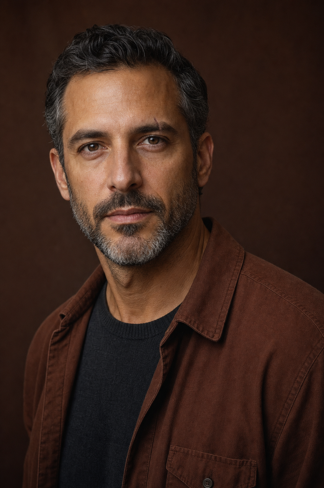
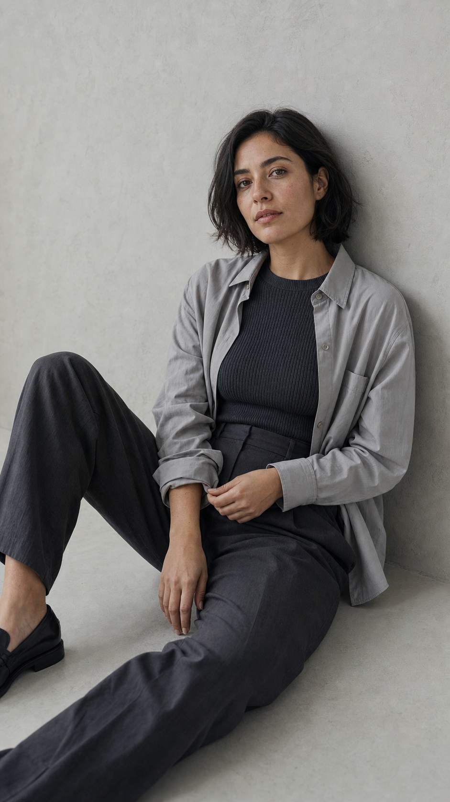
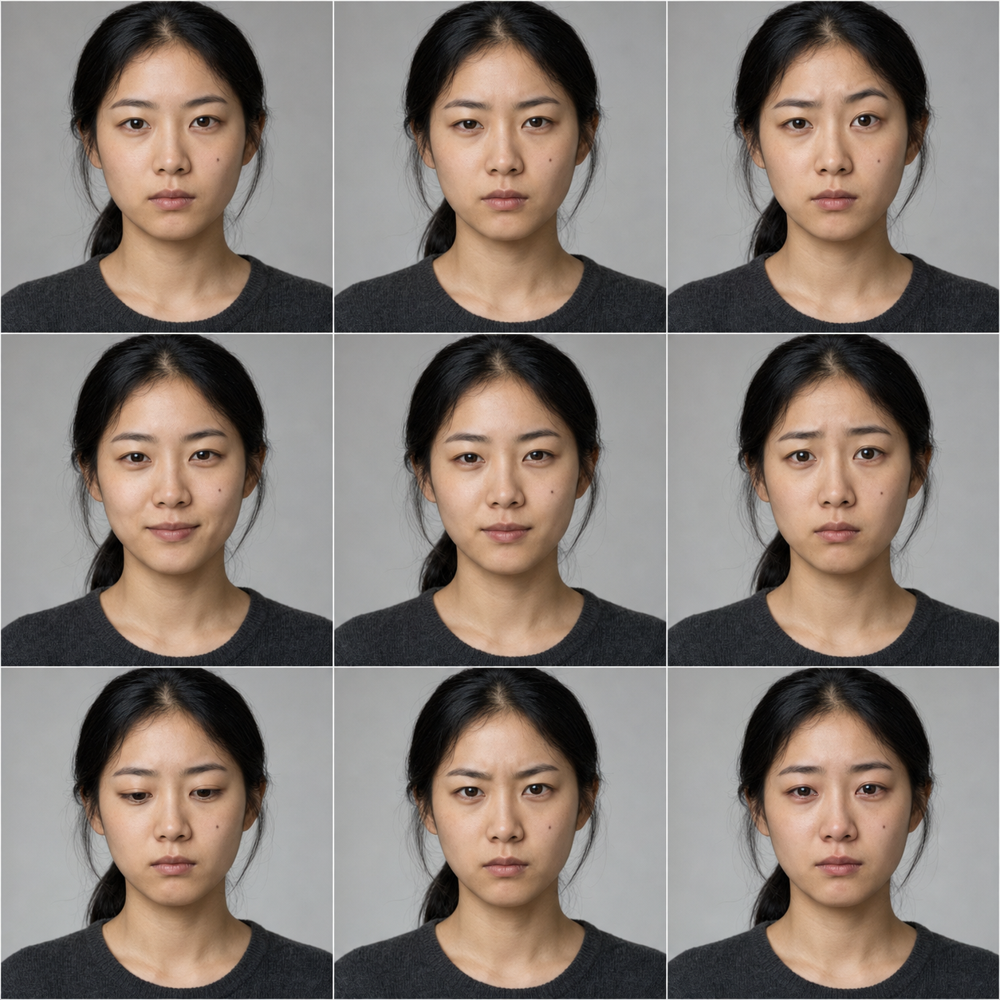
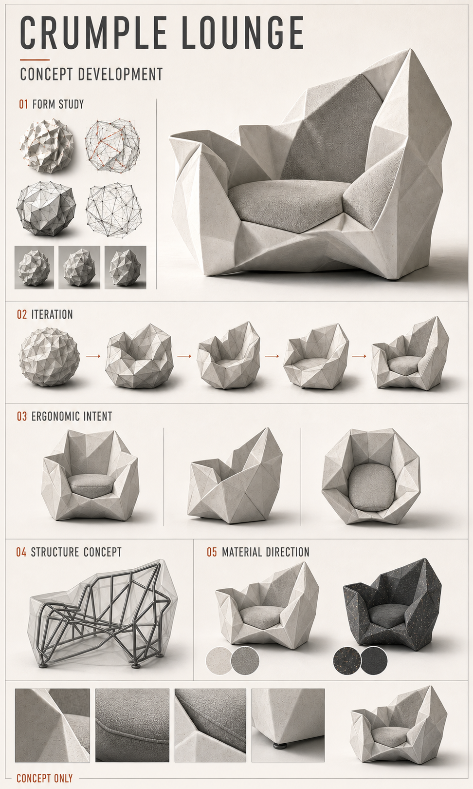

# Gallery / 效果图

这里仅展示本项目已经优化 Prompt、实际生成、人工复核并批准公开的第一方效果图。每张图都与最终 Prompt、SHA-256、尺寸、输入角色和审核状态绑定。

This gallery contains only first-party results whose prompts were refined, generated, visually reviewed, and approved for publication. Every image is bound to its final prompt, SHA-256, dimensions, input roles, and review status.

## 如何使用 / How to use

1. 先根据交付物选择相近的已验收方向，再打开该案例的最终 Prompt 与复核记录。/ First choose a nearby reviewed direction for the deliverable, then open its final Prompt and review record.
2. 只借鉴与当前 Brief 共同需要的构图、光线、材质或版式线索；不得复制案例中的人物身份、主体、品牌、可见文字或水印。/ Reuse only composition, lighting, material, or layout cues also required by the current Brief; never copy a case identity, subject, brand, visible text, or watermark.
3. 效果图用于人工比较，不是复现承诺。新的候选仍须通过文件 QC、逐项视觉复核、独立批准和 manifest 写入。/ Images support human comparison; they are not a reproducibility promise. Every new candidate still needs file QC, itemized visual review, independent approval, and manifest entry.

## Character Design Sheet / 人物角色设定表

- [Final prompt and review / 最终 Prompt 与复核](prompts/character-design-sheet-mara-venn.md)
- Original fictional adult character / 原创虚构成年角色
- 1672 × 941, PNG/RGB
- Identity, outfit, anatomy, labels, and multi-view consistency passed visual review / 身份、服装、人体、文字和多视图一致性已通过视觉复核

## Realistic Photography / 真实人物摄影

- [Final prompt and review / 最终 Prompt 与复核](prompts/realistic-photography-mara-venn.md)
- Uses the project-created character sheet as an identity and wardrobe reference / 使用本项目角色设定表作为身份与服装参考
- 1122 × 1402, PNG/RGB, 4:5
- Face, skin, hands, wardrobe, environment, and no-text requirements passed visual review / 面部、肤色、手部、服装、环境和无文字要求已通过视觉复核

## Realistic Fashion Lookbook / 写实时装 Lookbook

- [Final prompt and review / 最终 Prompt 与复核](prompts/realistic-fashion-lookbook-noa-reyes.md)
- New fictional adult identity with no real-person or external image reference / 全新虚构成年人物，不使用真人或外部图片参考
- 1122 × 1402, PNG/RGB, 4:5
- Six-cell identity, full-body framing, wardrobe differentiation, anatomy, photorealism, and no-text requirements passed visual review / 六格身份、完整全身、穿搭差异、人体、写实感和无文字要求已通过视觉复核

## Exploded Product Diagram / 产品分解结构图

- [Final prompt and review / 最终 Prompt 与复核](prompts/exploded-product-diagram-orbital-frame-one.md)
- Original fictional product with no external product, trademark, or image reference / 原创虚构产品，不使用外部产品、商标或图片参考
- 1122 × 1402, PNG/RGB, 4:5
- Nine-layer hierarchy, internal assembly plausibility, materials, symmetry, complete framing, and no-text requirements passed visual review / 九层层级、内部装配可信度、材质、对称性、完整构图和无文字要求已通过视觉复核

## Quiet Editorial Portrait / 静谧编辑人像

- [Final prompt and review / 最终 Prompt 与复核](prompts/quiet-editorial-portrait-mira-kang.md)
- New fictional adult identity with no real-person or external image reference / 全新虚构成年人物，不使用真人或外部图片参考
- 941 × 1672, PNG/RGB, 9:16
- Adult identity, modest wardrobe, natural seated anatomy, hands, muted interior, photographic texture, negative space, and no-text requirements passed visual review / 成年身份、端庄穿搭、自然坐姿人体、手部、低饱和室内、摄影质感、留白和无文字要求已通过视觉复核

## Realistic Motion Editorial / 写实动态编辑摄影

- [Final prompt and review / 最终 Prompt 与复核](prompts/realistic-motion-editorial-leo-navarro.md)
- New fictional adult identity with no real-person or external image reference / 全新虚构成年人物，不使用真人或外部图片参考
- 1003 × 1568, PNG/RGB, vertical full-body frame / 竖幅全身构图
- Adult identity, believable grounded movement, complete hands and shoes, modest unbranded workwear, wet urban material, photorealism, and no-text requirements passed visual review / 成年身份、可信落地动作、完整手脚、端庄无品牌工作服、湿润城市材质、写实感和无文字要求已通过视觉复核

## Documentary Craft Portrait / 写实手作纪实人像

- [Final prompt and review / 最终 Prompt 与复核](prompts/documentary-craft-portrait-anika-rowan.md)
- New fictional adult identity with no real-person or external image reference / 全新虚构成年人物，不使用真人或外部图片参考
- 864 × 1821, PNG/RGB, vertical complete-work frame / 竖幅完整工作构图
- Adult identity, hands shaping one clay bowl, complete seated body and shoes, modest unbranded workwear, natural workshop materials, photorealism, and no-text requirements passed visual review / 成年身份、双手塑造单一陶碗、完整坐姿和鞋部、端庄无品牌工作服、自然工作室材质、写实感和无文字要求已通过视觉复核

## Documentary Music Rehearsal / 写实音乐排练纪实人像

- [Final prompt and review / 最终 Prompt 与复核](prompts/documentary-music-rehearsal-elise-moreau.md)
- New fictional adult identity with no real-person or external image reference / 全新虚构成年人物，不使用真人或外部图片参考
- 864 × 1821, PNG/RGB, vertical figure-and-instrument frame / 竖幅人物与乐器构图
- Adult identity, complete hands, bow, cello, shoes, credible instrument structure, natural rehearsal materials, photorealism, and no-text requirements passed visual review / 成年身份、完整双手、琴弓、大提琴、鞋部、可信乐器结构、自然排练材质、写实感和无文字要求已通过视觉复核

## Mature Documentary Portrait / 成熟年龄纪实人像

- [Final prompt and review / 最终 Prompt 与复核](prompts/mature-documentary-portrait-nora-vale.md)
- New fictional mature adult identity with no real-person or external image reference / 全新虚构成熟成年人物，不使用真人或外部图片参考
- 864 × 1821, PNG/RGB, vertical full-body environmental frame / 竖幅完整全身环境构图
- Natural age detail, complete standing anatomy, both hands, notebook/rail contact, practical unbranded workwear, rain-damp marsh materials, photorealism, and no-text requirements passed visual review / 自然年龄特征、完整站姿、双手、笔记本与栏杆接触、实用无品牌服装、雨后盐沼材质、写实感和无文字要求已通过视觉复核

## Realistic Hairstyle Variation Board / 写实发型变化咨询板

- [Final prompt and review / 最终 Prompt 与复核](prompts/realistic-hairstyle-variation-board-maris-vale.md)
- New fictional adult identity with no real-person or external image reference / 全新虚构成年人物，不使用真人或外部图片参考
- 972 × 1619, PNG/RGB, 3 × 4 head-and-shoulders comparison grid / 3 × 4 头肩人像对比网格
- Twelve stable identity cells, distinct plausible hairstyles, clear eyes, constant studio conditions, natural skin and hair, photorealism, and no-text requirements passed visual review / 十二格身份稳定、发型明确且可信、双眼清晰、影棚条件恒定、自然皮肤与发丝、写实感和无文字要求已通过视觉复核

## Concept Poster Visual Plate / 概念海报视觉底板

- [Final prompt and review / 最终 Prompt 与复核](prompts/concept-poster-visual-plate-solstice-void.md)
- Original visual plate with no external image, brand, or recognisable-artwork reference / 原创视觉底板，不使用外部图片、品牌或可识别既有作品参考
- 1024 × 1536, PNG/RGB, vertical typography-safe visual plate / 竖幅文字安全视觉底板
- Complete folded-paper ring, one interior disc, controlled color and material hierarchy, practical typography-safe zones, no-text, and no-brand requirements passed visual review / 完整折纸环、单一内景圆盘、受控色彩与材质层级、可用文字安全区、无文字和无品牌要求已通过视觉复核

## Tonal Studio Editorial Portrait / 暖调影棚编辑人像

- [Final prompt and review / 最终 Prompt 与复核](prompts/tonal-studio-editorial-portrait-arden-sloane.md)
- Newly specified fictional adult identity with no real-person or external image reference / 全新设定的虚构成年身份，不使用真人或外部图片参考
- 1023 × 1537, PNG/RGB, vertical warm-tonal head-and-shoulders studio portrait / 竖幅暖调头肩影棚人像
- Clear eyes, complete crown and chin, natural pores, age detail, beard and clothing material, restrained unbranded studio treatment, and no-text requirements passed visual review / 清晰双眼、完整头顶与下巴、自然毛孔、年龄细节、胡须与服装材质、克制无品牌影棚表达和无文字要求已通过视觉复核

## Minimal Floor Editorial Portrait / 极简落地编辑人像

- [Final prompt and review / 最终 Prompt 与复核](prompts/minimal-floor-editorial-portrait-lea-orren.md)
- Newly specified fictional adult identity with no real-person or external image reference / 全新设定的虚构成年身份，不使用真人或外部图片参考
- 941 × 1672, PNG/RGB, vertical floor-seated minimalist indoor editorial portrait / 竖幅落地坐姿极简室内编辑人像
- Complete crown, hands, knees, modest layered wardrobe, natural skin and textile material, quiet negative space, and non-sexualized requirements passed visual review / 完整头顶、双手、双膝、端庄叠穿、自然皮肤与织物材质、安静留白和非性感化要求已通过视觉复核

## Realistic Micro-Expression Board / 写实微表情板

- [Final prompt and review / 最终 Prompt 与复核](prompts/realistic-micro-expression-board-jiayi-ren.md)
- New fictional young Asian adult identity with no real-person or external image reference / 全新虚构亚洲年轻成年身份，不使用真人或外部图片参考
- 1254 × 1254, PNG/RGB, 3 × 3 head-and-shoulders expression grid / 3 × 3 头肩微表情网格
- Nine stable identity cells, restrained readable expressions, constant studio conditions, natural skin and eye detail, no glamour treatment, and no-text requirements passed visual review / 九格身份稳定、表情克制且可读、影棚条件恒定、皮肤与眼部细节自然、无广告精修和无文字要求已通过视觉复核

## Product Commerce Visual / 商品商业视觉

- [Final prompt and review / 最终 Prompt 与复核](prompts/product-commerce-visual-aurora-mini.md)
- Original fictional product / 原创虚构产品
- 1672 × 941, PNG/RGB
- Geometry, materials, exact text, and semantic callouts passed visual review / 几何、材质、逐字文字和语义标注已通过视觉复核

## Concept Design Process Board / 概念设计过程板

- [Final prompt and review / 最终 Prompt 与复核](prompts/concept-design-process-board-crumple-lounge.md)
- Project-created first-party edit target; original source is not distributed as an approved Gallery asset / 使用本项目创建的第一方编辑源图；原始源图不作为已批准 Gallery 资产发布
- 972 × 1619, PNG/RGB, vertical industrial-design process board / 竖幅工业设计过程板
- Exact title and stage labels, one coherent chair identity, five-step form evolution, concept views, frame and material intent, clear hierarchy, and no unsupported measurements or engineering claims passed visual review / 准确标题与阶段标签、统一座椅身份、五步形态演化、概念视图、骨架与材质意图、清晰层级以及无未经支持的尺寸或工程声明均通过视觉复核

## Publication rule / 发布规则

`gallery-manifest.json` 是效果图白名单。自动测试会核对图片与 Prompt 哈希、尺寸、格式、输入角色、案例目录和审核状态。未写入 manifest 的图片、未通过候选和本地缓存不得进入 Gallery。

`gallery-manifest.json` is the publication allowlist. Automated tests verify image and prompt hashes, dimensions, format, input roles, catalog linkage, and review status. Unmanifested images, rejected candidates, and local caches must not enter the gallery.
