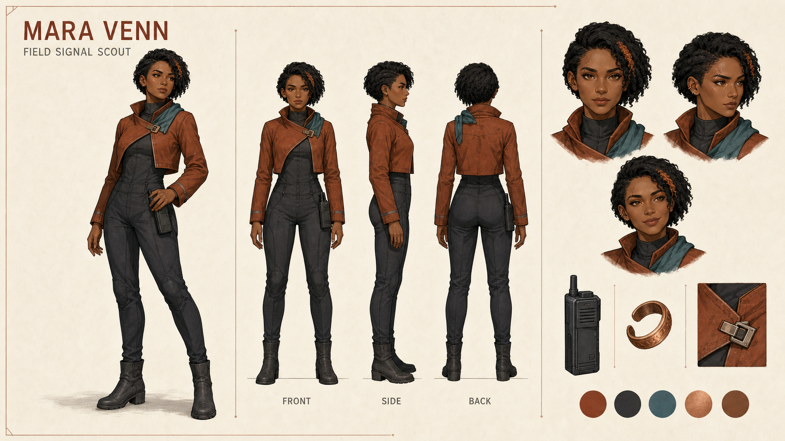
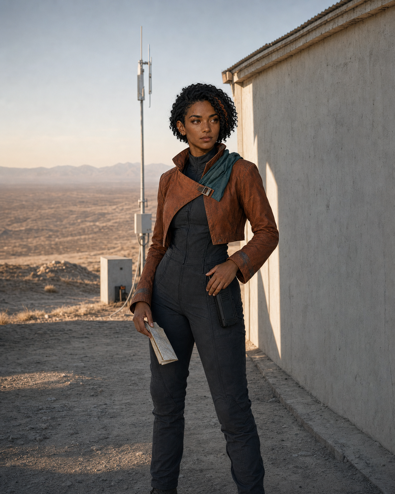
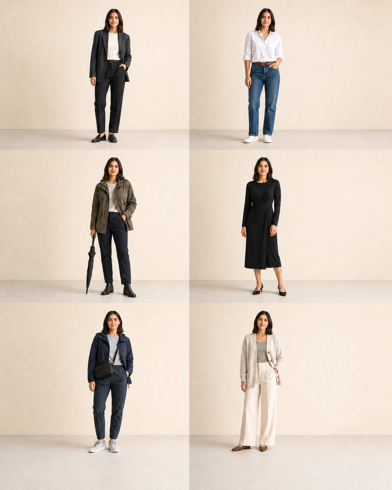
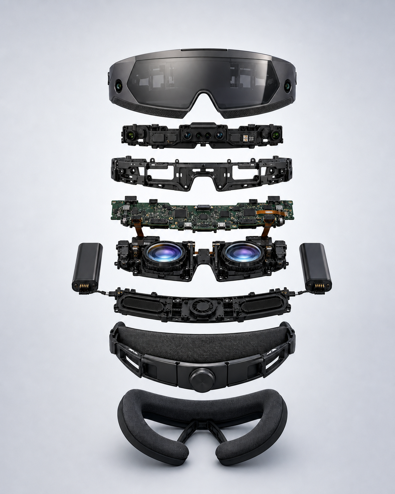
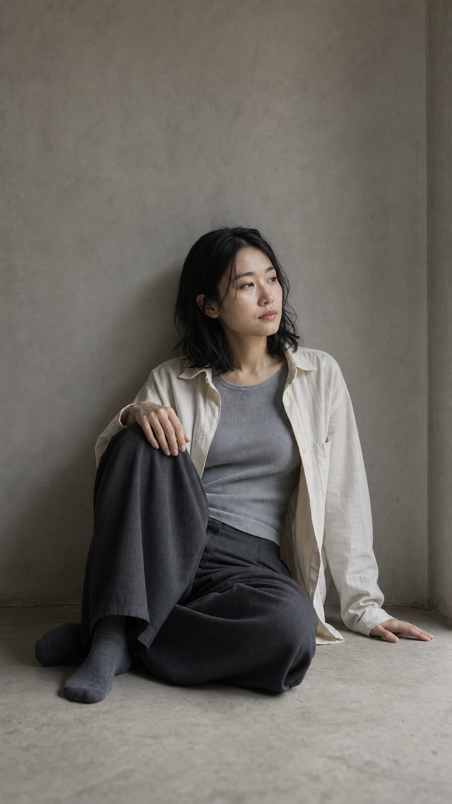
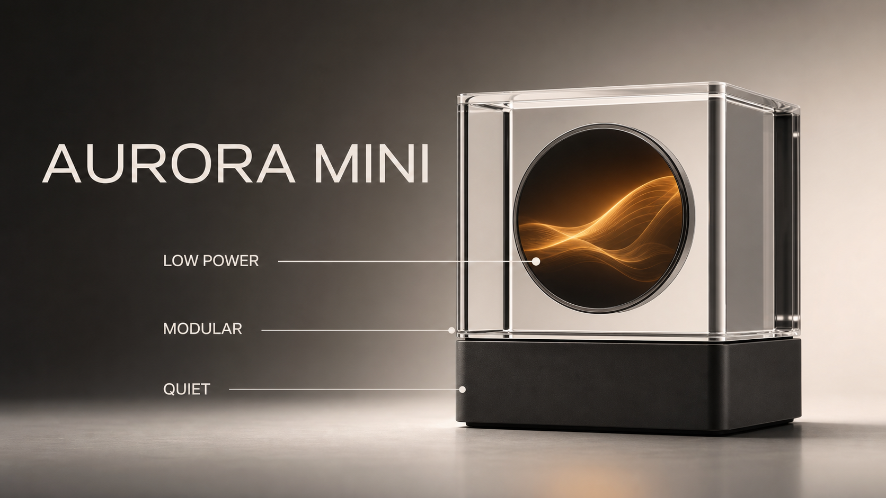

# Gallery / 效果图

这里仅展示本项目已经优化 Prompt、实际生成、人工复核并批准公开的第一方效果图。每张图都与最终 Prompt、SHA-256、尺寸、输入角色和审核状态绑定。

This gallery contains only first-party results whose prompts were refined, generated, visually reviewed, and approved for publication. Every image is bound to its final prompt, SHA-256, dimensions, input roles, and review status.

## Character Design Sheet / 人物角色设定表

- [Final prompt and review / 最终 Prompt 与复核](prompts/character-design-sheet-mara-venn.md)
- Original fictional adult character / 原创虚构成年角色
- 1672 × 941, PNG/RGB
- Identity, outfit, anatomy, labels, and multi-view consistency passed visual review / 身份、服装、人体、文字和多视图一致性已通过视觉复核

## Realistic Photography / 真实人物摄影

- [Final prompt and review / 最终 Prompt 与复核](prompts/realistic-photography-mara-venn.md)
- Uses the project-created character sheet as an identity and wardrobe reference / 使用本项目角色设定表作为身份与服装参考
- 1122 × 1402, PNG/RGB, 4:5
- Face, skin, hands, wardrobe, environment, and no-text requirements passed visual review / 面部、肤色、手部、服装、环境和无文字要求已通过视觉复核

## Realistic Fashion Lookbook / 写实时装 Lookbook

- [Final prompt and review / 最终 Prompt 与复核](prompts/realistic-fashion-lookbook-noa-reyes.md)
- New fictional adult identity with no real-person or external image reference / 全新虚构成年人物，不使用真人或外部图片参考
- 1122 × 1402, PNG/RGB, 4:5
- Six-cell identity, full-body framing, wardrobe differentiation, anatomy, photorealism, and no-text requirements passed visual review / 六格身份、完整全身、穿搭差异、人体、写实感和无文字要求已通过视觉复核

## Exploded Product Diagram / 产品分解结构图

- [Final prompt and review / 最终 Prompt 与复核](prompts/exploded-product-diagram-orbital-frame-one.md)
- Original fictional product with no external product, trademark, or image reference / 原创虚构产品，不使用外部产品、商标或图片参考
- 1122 × 1402, PNG/RGB, 4:5
- Nine-layer hierarchy, internal assembly plausibility, materials, symmetry, complete framing, and no-text requirements passed visual review / 九层层级、内部装配可信度、材质、对称性、完整构图和无文字要求已通过视觉复核

## Quiet Editorial Portrait / 静谧编辑人像

- [Final prompt and review / 最终 Prompt 与复核](prompts/quiet-editorial-portrait-mira-kang.md)
- New fictional adult identity with no real-person or external image reference / 全新虚构成年人物，不使用真人或外部图片参考
- 941 × 1672, PNG/RGB, 9:16
- Adult identity, modest wardrobe, natural seated anatomy, hands, muted interior, photographic texture, negative space, and no-text requirements passed visual review / 成年身份、端庄穿搭、自然坐姿人体、手部、低饱和室内、摄影质感、留白和无文字要求已通过视觉复核

## Product Commerce Visual / 商品商业视觉

- [Final prompt and review / 最终 Prompt 与复核](prompts/product-commerce-visual-aurora-mini.md)
- Original fictional product / 原创虚构产品
- 1672 × 941, PNG/RGB
- Geometry, materials, exact text, and semantic callouts passed visual review / 几何、材质、逐字文字和语义标注已通过视觉复核

## Publication rule / 发布规则

`gallery-manifest.json` 是效果图白名单。自动测试会核对图片与 Prompt 哈希、尺寸、格式、输入角色、案例目录和审核状态。未写入 manifest 的图片、未通过候选和本地缓存不得进入 Gallery。

`gallery-manifest.json` is the publication allowlist. Automated tests verify image and prompt hashes, dimensions, format, input roles, catalog linkage, and review status. Unmanifested images, rejected candidates, and local caches must not enter the gallery.
